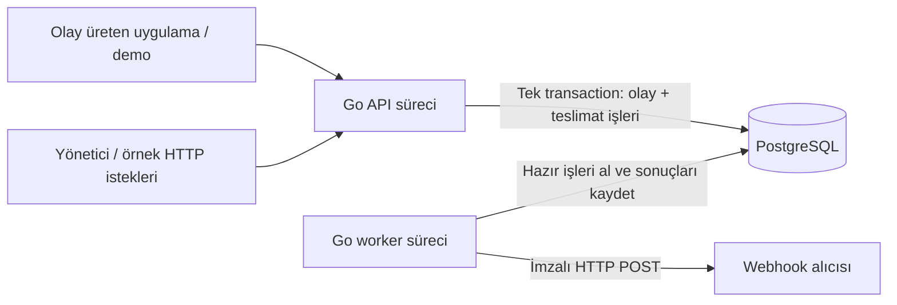

# HookRelay — sürüm sürüm geliştirme planı

Plan tarihi: 23 Eylül 2026
Durum: yerel v1.0/HR-029 kabulü tamamlandı. Dış HTTPS hedefi yapılandırılabilir; gerçek internet alıcısına gönderim denenmedi. Race detector Linux CI'da geçti; yayımlanmış sürüm etiketi yoktur. Sonuç [docs/releases/v1.0.md](docs/releases/v1.0.md) dosyasında.
Hedef: Yerelde çalıştırılabilen ve mühendislik kararları gösterilebilen v1.0. AWS isteğe bağlıdır.

## 1. Projenin amacı ve sınırları

HookRelay, bir uygulamanın gönderdiği olayı kabul eder, kaydeder, kayıtlı hedeflere imzalı HTTP webhook gönderir ve her gönderim girişiminin sonucunu saklar. Geçici hatalarda belirli sınırlar içinde yeniden dener. Örneğin `order.created` olayının iki kayıtlı alıcıya iletilmesi ve alıcılardan biri geçici olarak kapalıyken işin nasıl toparlandığı gösterilir. Ödeme veya gerçek müşteri verisi kullanılmaz.

Bu proje .NET ile yapılan OpsDesk ve AccountFlow'u tekrarlamak yerine Go, eşzamanlı çalışma, SQL işlemleri, hata senaryoları ve işletim becerilerini görünür kılar. OpsDesk mevcut kapsamıyla bırakılır; bu plan onun dosyalarını değiştirmez.

İlk hedef tek yöneticiye ait bir kurulumdur. Çok kiracılı SaaS, üyelik/rol sistemi, faturalama, büyük frontend, Kafka/RabbitMQ/Redis, mikroservis ağı, servis ağı katmanı, çok bölge ve yüksek erişilebilir veritabanı v1.0 kapsamı dışındadır. Kullanıcı arayüzü yerine OpenAPI, örnek HTTP istekleri ve küçük bir demo alıcısı yeterlidir.

Bu dosyadaki sürümler çalışma kilometre taşlarıdır; Git etiketi veya yayımlanmış sürüm değildir. 28 Eylül 2026'da kullanıcı public GitHub deposu açılmasını ve kodun pushlanmasını istedi. Ücretli kaynak açılmaz.

## 2. Yol haritası

| Sürüm | Gösterilecek sonuç | Ön koşul |
| --- | --- | --- |
| v0.1 | Olay API üzerinden kabul edilir ve teslimat işleriyle birlikte PostgreSQL'e yazılır | İlk sözleşme ve yerel araç kontrolü |
| v0.2 | Tek worker imzalı webhook gönderir ve girişim geçmişini tutar | v0.1 |
| v0.3 | Tekrarlanan API isteği çoğalmaz; geçici teslimat hataları sınırlı yeniden denenir | v0.2 |
| v0.4 | Birden çok worker ve süreç çökmesi altında işler toparlanır | v0.3 |
| v0.5 | Hedef yönetimi ve dış ağ gönderimi güvenlik testlerinden geçer | v0.4 |
| v0.6 | İşletim sorunları ölçülür; saklama, yedek ve geri yükleme denenir | v0.5 |
| v0.7 | Bütün demo Docker Compose ile tekrar kurulabilir | v0.6 |
| v0.8 | Aynı servis yerel Kubernetes üzerinde işletilir | v0.7 |
| v1.0 | Başka biri belgeleri izleyerek testleri ve arıza demosunu çalıştırabilir | v0.8 |
| v1.1 — isteğe bağlı | Bütçesi belirlenmiş kısa bir AWS kurulumu yapılır ve kaldırılır | v1.0 + ayrı bulut kararı |
| v1.2 — isteğe bağlı | EKS'nin getirdiği işletim farkı gösterilir | v1.0 + AWS temelleri + ayrı EKS kararı |

Her sürüm küçük görevlerle tamamlanır. Sonraki sürümün teknolojisi önceki sürümün bitmesini engellememelidir. Haftalık zaman ve Go deneyimi henüz bilinmediğinden takvim sözü verilmez; v0.1 sonunda gerçekleşen çalışma süresiyle tahmin yapılır. Varsayım, genel backend bilgisi olan ancak Go'yu bu projede öğrenen tek geliştiricidir.

## 3. Başlangıç mimarisi



API ve worker aynı Go modülündeki ortak iş kurallarını kullanır; ayrı süreç olarak başlatılır. Ayrı deploy edilebilmeleri, ayrı mikroservisler veya ayrı veritabanları kurmayı gerektirmez. API hızlıca kabul/kayıt işini yapar; worker daha uzun süren ağ gönderimlerini yürütür. API isteği açıkken webhook sonucu beklenmez.

Başlangıç araç kararı: `net/http`, `encoding/json`, `context`, `log/slog`, `testing` ve `httptest`; PostgreSQL erişimi için `database/sql` ile uyumlu bir PostgreSQL sürücüsü. Karmaşık framework veya genel repository katmanı başlangıç şartı değildir. Kullanılacak Go, PostgreSQL, sürücü ve migration aracı sürümleri uygulama başladığında destek durumları kontrol edilerek sabitlenir; bu plan bir kurulum betiği değildir.

İlk sürümlerde Go süreçleri doğrudan yerelde çalışır. PostgreSQL için mevcut yerel kurulum tercih edilir; yoksa yalnızca veritabanını çalıştıran container yardımcı olabilir. Uygulamanın Docker ile paketlenmesi v0.7'dedir. Windows ortamındaki Go/PostgreSQL/WSL/container kurulumu henüz kontrol edilmemiştir; ilk görev bunu salt okunur biçimde belirler.

### Veri modeli ve tutarlılık

| Kayıt | Görevi | Başlangıç / genişleme |
| --- | --- | --- |
| `endpoints` | Yöneticiye ait hedef, etkinlik durumu ve gizli anahtar referansı | v0.1 yalnızca kontrollü demo hedefi; v0.5 yönetim API'si |
| `events` | Değişmez olay kimliği, türü, kabul zamanı ve gönderilecek gövde | v0.1 |
| `deliveries` | Olay-hedef çifti için kalıcı iş, durum ve hedef sürümü | v0.1; v0.3 zamanlama; v0.4 sahiplik süresi |
| `delivery_attempts` | Her işleme girişiminin başlangıcı, sonucu, HTTP kodu ve hata sınıfı | v0.2; v0.4 belirsiz/yarım girişim |
| `idempotency_keys` | Üretici anahtarı + istek anahtarı + istek özeti + sonuç kimliği | v0.3 |

Olay ve tüm seçilmiş hedeflere ait teslimat satırları **aynı veritabanı işlemi** içinde oluşur. Herhangi biri başarısızsa tamamı geri alınır. Başarılı commit sonrasında API `202 Accepted` döner. Hedeflerden biri geçersizse kısmi kabul yapılmaz. Sınırlı sayıda hedef açıkça olay isteğinde seçilir; dinamik abonelik motoru yoktur. Başlangıç sınır önerileri: gövde 256 KiB, olay başına en çok 10 benzersiz hedef; gerçek ölçümle değiştirilebilir.

`UNIQUE(event_id, endpoint_id)` aynı olaya yanlışlıkla iki teslimat işi açılmasını engeller. v0.3'te giriş idempotency kaydı da aynı transaction'a katılır. Commit sonrasında API yanıtı kaybolsa bile aynı anahtarla gelen tekrar önceki olay kimliğini bulur. Transaction içindeki sorgular aynı transaction nesnesini kullanmalıdır. [Go transaction rehberi](https://go.dev/doc/database/execute-transactions)

`deliveries` aynı zamanda kalıcı iş kuyruğudur; başlangıçta veritabanı ve ayrı broker'a iki ayrı yazma yapılmaz. Bellekteki channel yalnızca sınırlı eşzamanlılığı düzenleyebilir, kabul edilmiş işin tek saklandığı yer olamaz. Broker ancak ölçülen bir ihtiyaç doğarsa sonraki bağımsız çalışmadır: transaction içinde outbox kaydı, tekrar yayımlayabilen publisher, alıcı tarafında deduplication ve ilgili arıza testleri birlikte tasarlanır. Broker eklemek tek başına tutarlılığı çözmez.

Hedef URL'si teslimat oluşturulurken sürümlenir/sabitlenir; sonraki hedef değişikliği eski işleri sessizce başka adrese taşımaz. Hedefi devre dışı bırakmak yeni gönderimleri durdurur, devam eden HTTP isteğini geri alamaz. Kuyruktaki işler `blocked` olur; yönetici açıkça yeniden etkinleştirince devam eder. Güvenlik politikası sabitlenmiş eski URL'lere de her gönderimde uygulanır.

### Teslimat sözleşmesi

- `202`, olayın ve işlerinin kaydedildiği anlamına gelir; alıcının işlemi bitirdiği anlamına gelmez. Dayanıklılık PostgreSQL'in kalıcılık ayarlarına, diske ve yedek politikasına bağlıdır.
- v0.2 tek girişimli prototiptir; v0.3 sınırlı retry ekler; v0.4 süreç çökmesinden toparlanmayı tamamlar. Önceki sürümler sonraki garantilere sahipmiş gibi sunulmaz.
- v1.0, yeniden gönderimin mümkün olduğu **at-least-once yaklaşımıyla sınırlı teslimat girişimi** yapar. Kalıcı hata, kapalı hedef, tükenen deneme/zaman bütçesi veya veri kaybı durumunda başarılı teslimat garantisi vermez. Uzak yan etki için exactly-once iddiası yoktur.
- Başarı, HookRelay'in geçerli bir `2xx` yanıtı gözlemlemesidir. Alıcının arka plandaki işinin tamamlandığını kanıtlamaz.
- Alıcı işlemi yapıp yanıt kaybolursa worker tekrar gönderebilir. Değişmeyen `delivery_id` alıcının deduplication anahtarıdır; her girişimin ayrı `attempt_id` değeri vardır.
- Örnek alıcı, `delivery_id` benzersiz kaydı ile kendi yan etkisini aynı transaction'da yapmayı gösterir. Bu yalnızca o örneğin kendi veritabanı içindeki etkisi için geçerlidir; harici servis etkilerini atomik hale getirmez.
- Teslimat sırası garanti edilmez. Global veya hedef başına FIFO, v1.0 şartı değildir.
- Otomatik retry mevcut teslimat kimliğini korur. v1.0'a keyfi manuel replay API'si alınmaz; ileride eklenirse ayrı yetki, kayıt ve kimlik sözleşmesi gerekir.

## 4. Sürümlerin uygulanabilir kapsamı

### v0.1 — Olayın güvenilir biçimde kabul edilmesi

- **Amaç:** Go API ile ilk kalıcı dikey parçayı tamamlamak.
- **Kapsam:** Go modülü, API başlangıcı, ayar doğrulama, PostgreSQL migration'ları, kontrollü demo hedefi; `POST /v1/events`, `GET /v1/events/{id}` ve `/livez`. Olay/teslimat transaction'ı, boyut/hedef sayısı sınırı, tutarlı hata yanıtları. Demo profilinde yalnızca localhost'a dinleyen API; üretici erişim anahtarı ortamdan alınır ve tüm iş API'lerinde zorunludur.
- **Kapsam dışı:** Worker, ağ gönderimi, retry, idempotency garantisi, rastgele URL kaydı, frontend, Docker uygulama paketi.
- **Somut teslimatlar:** Çalışan API, SQL migration'ları, ilk OpenAPI sözleşmesi, örnek kabul isteği, kısa yerel kurulum notu.
- **Öğrenilecekler:** Go paketleri, hata döndürme, HTTP handler, JSON doğrulama, context, SQL transaction.
- **Bağımlılıklar:** HR-001–003; kullanılabilir yerel PostgreSQL ve seçilmiş Go sürümü.
- **Anlamlı test/demo:** Gerçek PostgreSQL'de teslimat ekleme hatası oluşturulduğunda olayın da kaydedilmemesi; DB erişilemiyorsa `202` verilmemesi; yetkisiz istek reddi; restart sonrası olayın okunması. İkinci hedef geçersizken hiçbir kayıt oluşmaması.
- **Tamamlanma ölçütü:** Temiz veritabanından migration ile kurulum yapılır; kabul edilen bir olay ve hedef başına bir iş okunur; kısmi kayıt testi geçer. Aynı isteğin tekrarının henüz çoğalabileceği belgelenir.

### v0.2 — İmzalı tek gönderim ve geçmiş

- **Amaç:** Kabul edilen olayın kontrollü alıcıya gerçekten ulaşmasını göstermek.
- **Kapsam:** Ayrı `worker` süreci, tek worker/tek eşzamanlı gönderim, PostgreSQL polling, `pending → processing → succeeded/failed` durumları, girişim kaydı, `GET /v1/deliveries/{id}` ve sayfalı girişim geçmişi. HTTP timeout ve yanıt okuma sınırı ilk ağ gönderiminde bulunur. HMAC-SHA256, zaman damgası, anahtar kimliği ve imza doğrulayan demo alıcısı eklenir.
- **Kapsam dışı:** Otomatik retry, çok worker, otomatik çökme kurtarma, serbest internet hedefleri, anahtar döndürme API'si.
- **Somut teslimatlar:** Worker komutu, demo alıcısı, imza protokolü ve test vektörleri, girişim sorgulama örnekleri.
- **Öğrenilecekler:** HTTP client yaşam döngüsü, byte dizileri, HMAC, timeout, süreçler arası iş bölümü.
- **Bağımlılıklar:** v0.1. Yalnızca yerel demo alıcısının tam adresi ve portu yapılandırmada izinlidir; yönlendirme takibi kapalıdır.
- **Anlamlı test/demo:** Başarılı imza; değiştirilmiş gövde ve eski zaman damgası reddi; yavaş alıcıya timeout; büyük yanıtın sınırlanması; `2xx` ve `500` geçmişi. Süreç öldürülünce `processing` kalan işin görünür olması.
- **Tamamlanma ölçütü:** Olay kabulünden imzalı gönderime ve geçmiş sorgusuna uçtan uca demo çalışır. Süreç çökmesinde otomatik toparlanma olmadığı açıkça yazılır; prototip dış hedeflere açılmaz. HTTP beklerken DB transaction'ı açık tutulmaz.

### v0.3 — Idempotency ve kontrollü tekrar deneme

- **Amaç:** Üretici tekrarlarıyla teslimat tekrarlarını ayrı problemler olarak çözmek.
- **Kapsam:** `Idempotency-Key` zorunluluğu, üretici kapsamında benzersizlik ve istek özeti karşılaştırması. Aynı anahtar/aynı istek aynı event ID'yi döndürür; aynı anahtar/farklı içerik `409` olur. Kaydedilen gövde byte'ları, olay türü ve sıralanmış hedef listesi özet sözleşmesinde tanımlanır. DB tabanlı `next_attempt_at`, üstel bekleme ve rastgele sapma (jitter), maksimum girişim ve süre bütçesi, `retry_wait`/`dead` durumları eklenir.
- **Kapsam dışı:** Birden fazla worker, lease kurtarma, manuel replay, broker.
- **Somut teslimatlar:** Idempotency migration'ı, retry politika belgesi, hataya göre durum tablosu, ayarlanabilir saat/rastgelelik ile test edilebilir zamanlama.
- **Öğrenilecekler:** Benzersiz kısıtlar, eşzamanlı istek yarışı, geçici/kalıcı hata ayrımı, backoff, test edilebilir zaman.
- **Bağımlılıklar:** v0.2. Önerilen ilk politika: toplam 5 girişim, 15 dakika yaş sınırı, 1 saniyelik tabandan 60 saniye tavanlı full jitter; değerler bir ürün kararı olarak kaydedilir.
- **Anlamlı test/demo:** Aynı anahtarla eşzamanlı 20 kabul isteği tek olay üretir; commit sonrası yanıt kaybında tekrar önceki olayı bulur. Alıcı iki kez `500`, sonra `200` verir. `400` terminal kalır; `429` için geçerli `Retry-After` değerlendirilir; hatalı değer güvenli varsayılana düşer.
- **Tamamlanma ölçütü:** DNS/geçici ağ hatası, timeout, `408`, `429` ve `5xx` bütçeyle tekrar denenir; diğer `4xx`, `3xx`, TLS kimlik doğrulama ve güvenlik politika hataları otomatik tekrar edilmez. `Retry-After` bekleme alt sınırıdır; süre bütçesini aşarsa erken göndermek yerine iş sonlandırılır. İleri tarihli iş zamanı gelmeden alınmaz; restart ile zamanlama kaybolmaz. Süreç çökmesindeki yarım iş kurtarması hâlâ v0.4'e bağlıdır.

### v0.4 — Eşzamanlılık ve çökmeden toparlanma

- **Amaç:** Worker sayısı arttığında ve süreçler öldürüldüğünde iş durumunun açıklanabilir kalması.
- **Kapsam:** Sınırlı goroutine havuzu; kısa claim transaction'ı; `FOR UPDATE SKIP LOCKED`; `lease_until` ve her sahiplenmede değişen token; süresi dolmuş işlerin kurtarılması; token kontrollü sonuç güncellemesi; düzgün kapanış. En başta boş worker kapasitesi kadar iş sahiplenilir.
- **Kapsam dışı:** Sınırsız paralellik, otomatik ölçekleme, strict FIFO, yüksek erişilebilir PostgreSQL.
- **Somut teslimatlar:** Sahiplik/kurtarma migration'ı, çok worker entegrasyon testleri, süreç öldürme demosu, arıza matrisi ve teslimat garantisi belgesi.
- **Öğrenilecekler:** Goroutine, context iptali, veri yarışı, satır kilidi, lease, eski sahip yazmasını önleme ve dağıtık belirsizlik.
- **Bağımlılıklar:** v0.3. PostgreSQL, kuyruk benzeri tablolarda birden çok tüketicinin kilitli satırları atlaması için `SKIP LOCKED` kullanımını açıklar; genel sorgular için tutarlı görünüm sağlamaz. [PostgreSQL SELECT](https://www.postgresql.org/docs/current/sql-select.html)
- **Anlamlı test/demo:** İki worker ile 100 iş; claim öncesi, claim sonrası/gönderim öncesi ve alıcı işlemi sonrası/sonuç kaydı öncesi ayrı çökmeler. Süresi dolmuş eski worker sonucunun yeni sahibin sonucunu ezememesi. Gerçek PostgreSQL ve gerçek süreçlerle test; Go race detector, desteklenen geliştirme/test ortamında çalıştırılır.
- **Tamamlanma ölçütü:** Her kabul edilen iş test sonunda başarı, tekrar bekleme, engelli veya terminal bir durumda açıklanır; süresi dolmuş `processing` işler takılı kalmaz. Sonuç güncellemesi ve girişim sonucu tek transaction'dır. Alıcının işlemi yapıp yanıtı kaybettiği testte ikinci HTTP isteği görünür; örnek alıcının deduplication'ı yan etkinin ikinci kez yazılmasını önler.

Sahiplenme ile girişim kaydı ve deneme sayacı aynı transaction'da başlatılır. Ağ çağrısı commit'ten sonra yapılır. Çöken girişim `unknown` olarak kapanır; gönderimin kesin yapılmadığı iddia edilmez ve tüketilen deneme geri verilmez. Ağ timeout'u lease süresinden kısa seçilir, zaman hesabında DB saati kullanılır. İşlem duraklaması lease'i aşarsa iki uzak HTTP çağrısı yine örtüşebilir; token uzak alıcıdaki işlemi engellemez. Lease yalnızca yerel sahiplik ve sonuç yazımını düzenler.

### v0.5 — Güvenli hedef yönetimi

- **Amaç:** Servisin iç ağ tarayıcısı veya kontrolsüz gönderim aracı haline gelmesini önleyerek yönetilebilir hedefler eklemek.
- **Kapsam:** Yönetici erişim anahtarıyla hedef oluşturma/listeleme/devre dışı bırakma; üretici anahtarının bu yetkilere erişememesi; varsayılan olarak HTTPS ve dar port politikası; gönderim anında DNS/IP doğrulama; gizli anahtar referansları ve döndürme prosedürü; kabul ve gönderim hız/eşzamanlılık sınırları. Yönetici hesapları yerine yapılandırılmış iki ayrı yetki yeterlidir.
- **Kapsam dışı:** Çok kiracılı yetkilendirme, OAuth/SSO, genel proxy, müşteri tarafından serbest header/kimlik bilgisi ekleme, manuel replay.
- **Somut teslimatlar:** Hedef API sözleşmesi, tehdit modeli, ağ güvenlik testleri, secret hazırlama/döndürme talimatı ve log maskeleme denetimi.
- **Öğrenilecekler:** SSRF, DNS yeniden bağlama, TLS, en az yetki, secret yaşam döngüsü, kaynak tüketimini sınırlama.
- **Bağımlılıklar:** v0.4; kontrollü test DNS/transport altyapısı. URL doğrulaması ile bağlantı kurulmasını birlikte ele alma kararı [OWASP SSRF rehberine](https://cheatsheetseries.owasp.org/cheatsheets/Server_Side_Request_Forgery_Prevention_Cheat_Sheet.html) dayanır.
- **Anlamlı test/demo:** Loopback, özel ağ, link-local, bulut metadata adresleri, IPv6 ve IPv4-mapped IPv6, karma public/private DNS cevabı, redirect ve DNS adres değişimi reddedilir. API'ye verilen URL iç ağ isteği üretemez. Secret loglarda/API yanıtlarında görünmez; eski/yeni anahtarla geçiş testi çalışır.
- **Tamamlanma ölçütü:** Hedef kaydında ve her yeni bağlantı/retry sırasında politika uygulanır. DNS sonucundaki tüm adresler değerlendirilir; bağlantı yalnızca doğrulanmış IP'ye kurulur, TLS hostname doğrulaması korunur. Otomatik redirect ve ortamdan alınan denetimsiz proxy devre dışıdır. Demo iç ağ istisnası yalnızca ayrı dev profilindeki tam demo hedefine uygulanır; genel özel ağ izni değildir ve varsayılan profilde başlatılamaz.

İmza önerisi: sürümlü protokol içinde `timestamp.key_id.event_id.event_type.delivery_id.attempt_id.raw_body` byte dizisinin HMAC-SHA256 özeti. Alıcı sabit zamanlı karşılaştırma, örneğin 5 dakikalık zaman toleransı ve `delivery_id` deduplication uygular. Retry aynı gövde/teslimat kimliğini, yeni girişim kimliği/zaman/imzayı kullanır. Anahtar ID'si hangi secret'ın kullanılacağını belirtir. Gizli anahtarlar repo, image, DB düz metin alanı veya log içinde bulunmaz; DB yalnızca referans tutar. Yerelde git dışı izinleri kısıtlı dosya/ortam, container'da salt okunur secret dosyası kullanılır. Anahtar yoksa gönderim durur. Rotasyonda alıcı kısa ve tanımlı bir geçiş süresinde iki sürümü doğrular; bu süre bittikten sonra eski anahtar reddedilir.

### v0.6 — Gözlemlenebilirlik ve bakım

- **Amaç:** “Servis açık mı?” sorusunun yanında “teslimatlar neden gecikiyor?” sorusunu cevaplamak.
- **Kapsam:** Yapılandırılmış loglar, event/delivery/attempt korelasyonu; kabul, gönderim, sonuç, retry sayıları; kuyruktaki iş sayısı ve en eski işin yaşı; gönderim gecikmesi ve DB havuz ölçümleri. API readiness, worker sağlık/ilerleme kontrolü; saklama süresi, sınırlı temizlik ve yedek/geri yükleme prosedürü.
- **Kapsam dışı:** Büyük gözlem platformu, tüm servislerde distributed tracing, 7/24 SLA ve otomatik failover.
- **Somut teslimatlar:** Metrik uç noktası, örnek panel/sorgular, sorun giderme rehberi, yük deneyi raporu, temizlik ve geri yükleme demosu.
- **Öğrenilecekler:** Sayaç/histogram, ölçüm etiketlerinin sayısı, liveness/readiness ayrımı, kapasite, kalıcılık ve RPO/RTO kavramları.
- **Bağımlılıklar:** v0.5. Test ortamı, makine özellikleri, payload, hedef gecikmesi ve worker sayısı kaydedilir; ölçülmemiş performans iddiası yazılmaz.
- **Anlamlı test/demo:** Yavaş hedefte kuyruk yaşı artar; DB kesintisinde kabul başarısız olur ve yeniden bağlanınca işleme devam eder; 1 ve 4 worker sonucu karşılaştırılır. Yedek başka temiz DB'ye yüklenir ve olay/geçmiş okunur. Geri yükleme sırasında worker önce kapalı tutulur; eski yedekten dönen işlerin tekrar gönderilebileceği gösterilir.
- **Tamamlanma ölçütü:** Bir başarısız teslimat kimliğiyle nedeni bulunur; metriklerde event ID, ham URL veya secret etiket olarak kullanılmaz. DB kesintisi liveness restart fırtınası yaratmaz. Saklama başlangıç önerisi 30 gündür; idempotency de bu pencereyle sınırlıdır, süre bitince aynı anahtar yeni olay açabilir. İş devam ederken bağlı olay/idempotency kaydı temizlenmez. Yedeklerin ve alıcı deduplication süresinin bu pencereyle ilişkisi belgelenir.

### v0.7 — Docker ile tekrar kurulabilir demo

- **Amaç:** Makineye özgü adımları azaltmak ve API/worker çalışma ayrımını görünür kılmak.
- **Kapsam:** Çok aşamalı image derleme, root olmayan kullanıcı, API ve worker komutları; Compose içinde PostgreSQL, API, worker ve demo alıcısı; kalıcı DB volume'u; ayrı migration adımı; örnek secretsiz yapılandırma ve sağlık kontrolleri.
- **Kapsam dışı:** Kubernetes, image registry'ye yayın, AWS, veritabanını her uygulama başlangıcında otomatik değiştirme.
- **Somut teslimatlar:** Dockerfile, Compose dosyası, başlatma/durdurma ve veriyi koruyarak reset rehberi, smoke demo.
- **Öğrenilecekler:** Image/container farkı, volume, container ağı, sinyal iletimi ve container yapılandırması.
- **Bağımlılıklar:** v0.6; uygun yerel container runtime. Runtime kurulumu veya lisans uygunluğu gerektiğinde uygulama aşamasında kontrol edilir; bulut hesabı gerekmez.
- **Anlamlı test/demo:** Temiz ortamda image build ve migration; worker container'ını öldürme; stack'i veri volume'unu koruyarak yeniden başlatma; image katmanlarında secret bulunmadığını kontrol etme.
- **Tamamlanma ölçütü:** Belgelenmiş komutlarla demo kurulur; yeniden başlatmada geçmiş kaybolmaz; API/worker aynı image sürümünü kullanır. Demo hedefi için v0.5'teki dar dev istisnası Compose adresine uyarlanır, internete açık kurulum gibi sunulmaz.

### v0.8 — Yerel Kubernetes ile işletim

- **Amaç:** Container'ları bir işletim sistemi gibi yöneten Kubernetes'in neyi çözdüğünü uygulama üzerinde görmek.
- **Kapsam:** Yerelde kind; API ve worker için ayrı Deployment; API Service; ConfigMap ve git dışı Secret besleme; resource requests/limits; readiness/liveness ve uygun kapanış süresi; migration Job; rolling update ve worker replica deneyi. Demo DB için tek PostgreSQL instance ve PVC, açıkça yerel laboratuvar düzeyindedir.
- **Kapsam dışı:** EKS, ücretli LoadBalancer, public ingress/domain, service mesh, Helm zorunluluğu, autoscaler, üretim kalitesinde DB cluster.
- **Somut teslimatlar:** Küçük manifest kümesi, kurulup kaldırılan yerel cluster rehberi, rollout ve Pod kaybı demosu, cluster silinince veri davranışı notu.
- **Öğrenilecekler:** Pod, Deployment, Service, Job, volume, kaynak bütçesi, probe, rolling update. Kubernetes Deployment uygulama süreçlerinin kopyalarını yönetir; uygulamanın transaction veya idempotency kurallarının yerine geçmez. [Kubernetes workload rehberi](https://kubernetes.io/docs/concepts/workloads/controllers/)
- **Bağımlılıklar:** v0.7, yeterli yerel RAM/disk ve runtime. kind yerel Kubernetes cluster'larını container node'larıyla çalıştırır; AWS hesabı gerektirmez. [kind belgesi](https://kind.sigs.k8s.io/)
- **Anlamlı test/demo:** Worker replica sayısını 1'den 2'ye çıkarma; bir worker Pod'unu silme; API rollout'u boyunca istemci sonuçlarını gözleme; migration hatasında yayının ilerlememesi; graceful shutdown ve lease kurtarmasını birlikte gösterme.
- **Tamamlanma ölçütü:** Arıza matrisinin kritik senaryoları Kubernetes'te tekrar geçer. Pod silinmesi ile yerel cluster/veri diskinin silinmesi farklı sonuçlar doğurur ve belgelenir. Demo dış ağ erişimiyle açılmaz. NetworkPolicy ancak seçilen ağ eklentisi gerçekten uyguluyorsa koruma olarak sayılır; uygulama SSRF denetimi korunur. Kubernetes Secret, tek başına tam secret yönetimi çözümü olarak sunulmaz.

### v1.0 — Portföye hazır yerel ürün

- **Amaç:** Kodun yanında kararların, sınırların ve tekrarlanabilir kanıtların sunulması.
- **Kapsam:** README, mimari ve ADR belgeleri, OpenAPI, teslimat garantileri, güvenlik sınırları, işletim rehberi, kısa demo senaryosu/video taslağı ve sürüm notu. CI biçim, statik analiz, birim testleri, gerçek PostgreSQL entegrasyonu, Linux race testi ve image build'i çalıştırır.
- **Kapsam dışı:** Yeni büyük özellik, frontend paneli, AWS zorunluluğu, performans/SLA sertifikasyonu, otomatik Git yayını.
- **Somut teslimatlar:** Başka geliştiricinin takip edebileceği kurulum; başarılı/başarısız gönderim ve duplicate demosu; ölçüm koşullarıyla rapor; bilinen eksikler listesi; gözden geçirilebilir release paketi.
- **Öğrenilecekler:** API uyumluluğu, teknik karar anlatımı, tekrarlanabilir doğrulama ve dürüst portföy sunumu.
- **Bağımlılıklar:** v0.8 ve aşağıdaki kabul matrisi. GitHub erişimi yerel kontrollerin veya v1.0 paketinin tamamlanması için zorunlu değildir; uzaktan CI çalışmadıysa çalışmış gibi yazılmaz.
- **Anlamlı test/demo:** Temiz veritabanı/ortamdan README adımları; tek olayın iki hedefe teslimi; geçici hata sonrası başarı; terminal hata; commit yanıtı kaybı; worker çökmesi; alıcıda yinelenen istek ve tek yerel yan etki; SSRF reddi; Pod yenilenmesi.
- **Tamamlanma ölçütü:** Tüm zorunlu senaryoların beklenen/gerçek sonucu ve kanıtı kayıtlıdır. README vaatleri testlerle uyumludur; secret veya gerçek kişisel veri yoktur. Açık kritik güvenlik/veri tutarlılığı hatası yoktur.

## 5. AWS ve EKS: v1.0 sonrasındaki isteğe bağlı çalışmalar

Kubernetes bir yazılımdır; yerelde öğrenmek için EKS satın almak gerekmez. EKS, AWS'nin yönettiği Kubernetes hizmetidir. AWS kontrol düzlemini yönetir; uygulamanın erişimleri, ayarları ve verisiyle ilgili sorumluluklar devam eder. [AWS EKS güvenlik modeli](https://docs.aws.amazon.com/eks/latest/userguide/security.html)

EKS ücreti yalnızca gelen webhook sayısına bağlı değildir: cluster yönetimi ve kullanılan işlem, disk, ağ gibi kaynaklar ayrı maliyet kalemleridir. Bu nedenle boş duran kurulum da maliyet oluşturabilir. Bu planda rakam veya ücretsiz kullanım sözü verilmez; bölge ve kaynak listesi seçildiğinde güncel hesap yapılır. [Resmî EKS fiyatlandırması](https://aws.amazon.com/eks/pricing/)

### v1.1 — Küçük ve geçici AWS laboratuvarı

- **Amaç:** Kubernetes şart koşmadan bulutta erişim, ağ, secret ve işletim sorumluluklarını öğrenmek.
- **Kapsam:** Önce bölge, azami bütçe, çalışma süresi, kaldırma zamanı ve kaynak listesi içeren karar belgesi. Öğrenme önceliğine göre kısa ömürlü tek EC2 makinesinde Compose önerisi değerlendirilir; daha fazla yönetilen hizmet gerekiyorsa ECS/RDS ayrı maliyet/karmaşıklık karşılaştırmasına girer. EC2 sanal makine, RDS yönetilen veritabanı, ECS container işletme hizmetidir; hepsi aynı anda kurulmaz. Seçilen yol için dar ağ erişimi, TLS, rol bazlı AWS erişimi, secret temini, yedek, kurulum/kaldırma tanımı.
- **Kapsam dışı:** EKS zorunluluğu, 7/24 demo, üretim SLA'sı, çok bölge; tek makine içindeki DB için yüksek erişilebilirlik iddiası.
- **Somut teslimatlar:** Resmî güncel fiyat kaynaklarıyla maliyet tablosu, mimari kararı, tekrar kurulabilir altyapı tanımı, kısa demo ve kaldırma kanıtı.
- **Öğrenilecekler:** IAM, ağ/güvenlik grubu, TLS, bulut secret ve log yönetimi, maliyet takibi.
- **Bağımlılıklar:** v1.0; kullanıcının bütçe ve ücretli kaynak açma kararı. Burada yalnızca plan vardır, mevcut yetki kaynak açmayı kapsamaz.
- **Anlamlı test/demo:** Dışarıdan yalnızca amaçlanan API erişilebilir; DB public değildir; uygulama yeniden başlatılır; maliyet etiketleri ve kaynak envanteri kontrol edilir; kurulum kaldırılınca ücret doğurabilecek disk/IP/snapshot/log gibi kalanlar incelenir.
- **Tamamlanma ölçütü:** Güvenlik ve arıza smoke testleri geçer, gerçek harcama/çalışma süresi kaydedilir, kaynakların kaldırıldığı doğrulanır. Bütçe alarmı harcamayı kesin kesen tavan kabul edilmez; AWS bildirimlerinde gecikme olabilir. [AWS Budgets](https://docs.aws.amazon.com/cost-management/latest/userguide/budgets-managing-costs.html)

### v1.2 — EKS karşılaştırmalı öğrenme laboratuvarı

- **Amaç:** Yerel Kubernetes bilgisine yönetilen kontrol düzlemi, AWS ağı ve erişim modelini eklemek.
- **Kapsam:** Seçilmiş kısa süre için EKS, worker kapasitesi, image kaynağı, uygulama erişimleri, secret erişimi, rollout ve kaynak kaldırma. DB konumu, bağlantı ağı ve yedek maliyeti ayrı karar olarak açıklanır. Yerel manifestlerden taşınan ve AWS'ye özgü olan parçalar karşılaştırılır.
- **Kapsam dışı:** Üretim platformu kurmak, autoscaling zorunluluğu, çoklu cluster, platform ekibi ölçeği.
- **Somut teslimatlar:** EKS'yi neden denediğini açıklayan ADR, doğrulanmış maliyet hesabı, altyapı tanımı, rollout/Pod kaybı demosu ve kaldırma raporu.
- **Öğrenilecekler:** Yönetilen Kubernetes'in sınırları, cloud ağ modeli, workload kimliği ve maliyet/operasyon dengesi.
- **Bağımlılıklar:** v0.8/v1.0, AWS temelleri (v1.1 ile veya eşdeğer bilgiyle), ayrıca EKS bütçe kararı. v1.1'in bütün altyapısını yeniden kurmak zorunlu değildir.
- **Anlamlı test/demo:** Aynı uygulamanın yerel ve EKS davranışı karşılaştırılır; worker Pod kaybı, rollout, DB bağlantı kesintisi ve dar erişim kontrolleri denenir; tüm ücretli bağlı kaynaklar envanterden kaldırılır.
- **Tamamlanma ölçütü:** “EKS kullandım” yerine hangi işletim işini hizmetin üstlendiği, hangi sorumlulukların kaldığı ve deneyin ne kadar maliyet oluşturduğu kanıtlanır. Bu aşama yapılmasa da v1.0 portföy hedefi tamamdır.

## 6. Sürümlerden bağımsız küçük görev listesi

Her görev bir gözden geçirilebilir değişiklik ve onun doğrudan doğrulamasıyla kapanır. Aşağıdaki liste ilk iş bölümüdür; güncel durum ve kanıtlar [görev tablosundadır](docs/tasks.md).

| ID | Sürüm | Küçük görev ve bitiş kanıtı |
| --- | --- | --- |
| HR-001 | v0.1 | Go/PostgreSQL/container araçlarını ve klasör durumunu salt okunur kontrol et; kurulum ihtiyaç notunu çıkar. |
| HR-002 | v0.1 | Tek üretici, kontrollü hedef, örnek `order.created` gövdesi, HTTP yanıtları ve hata örneklerini sözleşmeye yaz. |
| HR-003 | v0.1 | Tek DB/kuyruk kararını ve ilk ER diyagramını yaz; event + delivery atomik kabulünü örnekle. |
| HR-004 | v0.1 | Go modülü ve API süreç yaşam döngüsü; geçerli/geçersiz yapılandırma ile çalıştır. |
| HR-005 | v0.1 | SQL migration ve transaction kabul akışı; gerçek DB'de kısmi hata testini geçir. |
| HR-006 | v0.1 | Kabul/okuma endpoint'leri, erişim ve boyut sınırları; uçtan uca kabul demosu. |
| HR-007 | v0.2 | Tek worker ve tek girişim geçmişi; pending işin sonuca dönüşmesini göster. |
| HR-008 | v0.2 | İmza sözleşmesi ve demo alıcısı; doğru/bozuk/eski imza test vektörleri. |
| HR-009 | v0.2 | HTTP süre/yanıt sınırı ve redirect reddi; kontrollü timeout demosu. |
| HR-010 | v0.3 | Idempotency migration ve kabul yolu; aynı anahtarla eşzamanlı istek testi. |
| HR-011 | v0.3 | Hata sınıflandırma, jitter, bütçe, Retry-After; sahte saatle tablo testleri. |
| HR-012 | v0.3 | Kalıcı zamanlama ve terminal durumlar; iki hata sonrası başarı demosu. |
| HR-013 | v0.4 | Atomik claim, token ve girişim başlangıcı; iki worker sahiplenme testi. |
| HR-014 | v0.4 | Lease kurtarma ve eski sonuç reddi; süreç öldürme senaryoları. |
| HR-015 | v0.4 | Sınırlı goroutine havuzu ve kapanış; race/kapasite kontrolü. |
| HR-016 | v0.4 | Yanıtı kaybeden alıcı ve DB tabanlı deduplication; duplicate sınırını belgeleyen demo. |
| HR-017 | v0.5 | Hedef yönetimi, URL sürümü, devre dışı bırakma ve yönetici/üretici yetkileri. |
| HR-018 | v0.5 | DNS/IP bağlantı politikası; iç ağ/IPv6/redirect/rebinding testleri. |
| HR-019 | v0.5 | Secret referansı/döndürme, log maskeleme ve hız sınırı testleri. |
| HR-020 | v0.6 | Korelasyon logları ve kuyruk/teslimat metrikleri; arızayı ölçümden bul. |
| HR-021 | v0.6 | Readiness/liveness ve DB kesintisi davranışı; restart fırtınası olmadığını göster. |
| HR-022 | v0.6 | Saklama/temizlik ve yedekten geri yükleme; idempotency penceresini doğrula. |
| HR-023 | v0.6 | Küçük yük deneyi; donanım/ayarlarla birlikte sonucu kaydet. |
| HR-024 | v0.7 | Image ve Compose; temiz başlangıç ve kalıcı volume demosu. |
| HR-025 | v0.8 | Yerel cluster/manifestler/migration Job; temel kurulum kanıtı. |
| HR-026 | v0.8 | İki worker replica, Pod kaybı ve rollout; aynı arıza kontrolleri. |
| HR-027 | v1.0 | README/OpenAPI/ADR/işletim belgelerini son davranışla eşleştir. |
| HR-028 | v1.0 | CI tanımı ve yerel eşdeğer kontroller; uzaktan çalıştırma durumu açık olsun. |
| HR-029 | v1.0 | Temiz kurulum, kısa demo ve sürüm kabul raporunu tamamla. |
| HR-030 | v1.1+ | Yalnızca ihtiyaç doğarsa bulut seçeneklerini, maliyeti ve kaldırmayı planla. |
| HR-031 | v1.0 yayın hazırlığı | Kaynak adayını, yerel kontrolleri ve GitHub Release metni taslağını kaydet; etiket/yayın ayrı kalsın. |

## 7. Test ve demo kabul matrisi

| Senaryo | Beklenen davranış | İlk zorunlu sürüm |
| --- | --- | --- |
| Olay kaydı var, teslimat ekleme başarısız | Transaction geri alınır; başarılı kabul yanıtı yok | v0.1 |
| Yetkisiz/çok büyük/geçersiz hedefli istek | Uygun hata, yeni iş yok | v0.1 |
| Geçerli/bozulmuş imza | İlki kabul, ikincisi ret | v0.2 |
| Alıcı yanıt vermiyor / sınırsız yanıt akıtıyor | Süre ve okuma sınırı; kaynaklar serbest bırakılır | v0.2 |
| Aynı idempotency anahtarıyla eşzamanlı kabul | Tek event ve hedef başına tek delivery | v0.3 |
| DB commit tamam, API yanıtı kayıp | Tekrar aynı event ID'yi verir | v0.3 |
| Geçici hata / kalıcı hata / tükenmiş bütçe | Zamanlanmış retry / terminal durum / dead | v0.3 |
| Worker claim'den sonra çöküyor | Lease sonrası toparlanır; girişim unknown olabilir | v0.4 |
| Alıcı işledi, sonuç kaydı veya yanıt kayıp | İkinci HTTP isteği mümkün; alıcı deduplication gösterilir | v0.4 |
| Eski lease sahibi geç sonuç yazıyor | Token koşulu nedeniyle yeni sonucu değiştiremez | v0.4 |
| Hedef devre dışı / URL değişmiş | Yeni gönderim engellenir / eski iş sessizce yön değiştirmez | v0.5 |
| İç ağ URL'si, DNS değişimi, redirect | Yasak adrese bağlantı kurulmaz | v0.5 |
| DB kesintisi ve geri gelmesi | Sahte başarı yok; kontrollü yeniden bağlanma | v0.6 |
| Yedekten geri yükleme / saklama süresi bitişi | İşler denetlenir; yeniden gönderim ve idempotency sınırı açık | v0.6 |
| Container/Pod yenilenmesi | Kalıcı iş/geçmiş korunur; yarım iş toparlanır | v0.7 / v0.8 |

Mock, retry hesaplama ve imza gibi saf iş kuralları için kullanılabilir; SQL kilitleri, benzersizlik, transaction ve kurtarma iddiaları gerçek PostgreSQL ile doğrulanır. Arıza testleri mümkün olduğunca kontrollü bariyer/sahte saat kullanır; keyfi uzun beklemeye dayanmaz. Kabul edilen işlerin sayısı, terminal/bekleyen iş sayıları ve kaydedilen girişimler karşılaştırılır; sadece HTTP `200` görülmesi testin geçtiği anlamına gelmez.

## 8. Önerilen repo ve doküman düzeni

Aşağıdaki ağaç başlangıçtaki hedef düzendir. Gerçek dosya düzeni repo kökünde görülebilir; kullanılmayan klasörler oluşturulmadı. CV görseli HookRelay projesinin parçası değildir.

```text
HookRelay/
  PLAN.md
  README.md
  go.mod
  go.sum
  cmd/
    api/                 # HTTP kabul ve sorgulama
    worker/              # Kalıcı işlerin gönderimi
    demo-receiver/       # İmza, hata ve deduplication demosu
  internal/
    config/
    httpapi/
    events/
    delivery/            # Durum, retry, sahiplik; ihtiyaç oldukça bölünür
    postgres/
    signing/
    targetpolicy/        # v0.5 ağ hedefi doğrulaması
    telemetry/           # v0.6
  migrations/
  api/openapi.yaml
  tests/integration/
  examples/              # İstekler ve secretsiz demo verileri
  deploy/
    compose/             # v0.7
    k8s/local/           # v0.8
  scripts/               # Küçük başlatma/doğrulama yardımcıları
  docs/
    architecture.md
    delivery-semantics.md
    security.md
    runbook.md
    decisions/           # Kısa ADR: sorun, karar, gerekçe, bedel
    releases/            # Sürüm başına kapsam ve gerçek doğrulama
    tasks.md             # Görev ID, durum, bağımlılık, kanıt
    demo.md
  .env.example           # Gerçek secret içermez
  .github/workflows/     # v1.0 CI tanımı
```

Önerilen ilk ADR'ler: aynı kod tabanı/iki süreç; PostgreSQL iş kuyruğu ve atomik kabul; retry/idempotency/duplicate sınırları; hedef güvenlik politikası; yerel Kubernetes'in öğrenme amacı. Kullanılmayan soyutlama veya boş katman klasörleri baştan üretilmez.

Görev durumları: `TODO → IN_PROGRESS → VERIFY → DONE`; dış bağımlılık varsa `BLOCKED` ve nedeni. `DONE` için görevde tanımlı gözlenebilir sonuç ve doğrulama kanıtı gerekir. Her sürümün sonunda uygulanan kapsam, çalıştırılan kontroller, bilinen eksikler ve sıradaki tek görev yazılır. Dokümanların “öneri” ile “uygulandı” durumları ayrı tutulur.

## 9. Başlangıç notu (tarihsel)

İlk iş **HR-001–003: v0.1 sözleşmesini sabitlemek**. Mevcut araçları kontrol et; örnek olayı, kontrollü demo hedefini, kabul/okuma yanıtını ve ilk veri modelini yaz. Çıktı `docs/architecture.md`, `api/openapi.yaml` taslağı ve ilk ADR olur. Bunlar hazır olunca HR-004–006 ile yalnızca API + PostgreSQL kabul dilimi uygulanır.

Bu ilk dilimin demosu şu kadar küçük kalır: “Bir olay gönder; event ID al; API sürecini yeniden başlat; aynı olayı oku; teslimat satırının pending olduğunu göster. Teslimat kaydı oluşturulamazsa olayın da oluşmadığını test et.” Worker ve altyapı genişlemesi sonraki sürümlerdedir.

HR-029 ile yerel v1.0 kabulü tamamlandı. HR-030 kapsamında [isteğe bağlı bulut seçenekleri, örnek maliyet ve kaldırma planı](docs/cloud-plan.md) hazırlandı. Bu plan kaynak açma kararı veya bulut kurulum kanıtı değildir.
AWS ertelendiği için HR-031 [yerel v1.0 yayın hazırlığı](docs/releases/v1.0-publication.md) olarak yapıldı; etiket veya GitHub Release oluşturulmadı.
