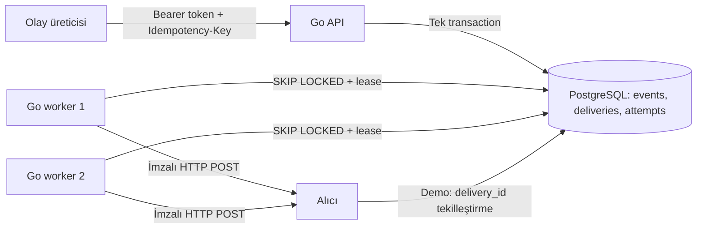

# Güncel yerel mimari (v0.8)

HookRelay, tek Go kod tabanından derlenen ayrı API, worker, migration ve demo alıcı süreçlerinden oluşur. PostgreSQL hem kalıcı olay/geçmiş deposu hem de teslimat iş kuyruğudur. Kullanıcı arayüzü ve harici broker yoktur. [İlk v0.1 mimari anlık görüntüsü](releases/v0.1.md) tarihsel davranışı gösterir; bu sayfa çalışan v0.8 davranışını anlatır.

`POST /v1/events`, en çok 256 KiB JSON ve 1–10 benzersiz, etkin hedef ID'si kabul eder. API tüm hedefleri doğrulayıp olay, hedef başına `pending` iş ve üretici/idempotency anahtarını tek PostgreSQL transaction'ında yazar; commit sonrası `202` döndürür. Bu yanıt HTTP teslimatının bittiği anlamına gelmez. Aynı anahtar ve aynı kaydedilen içerik aynı olayı döndürür; farklı içerik `409` olur. İş, hedef URL'si, sürümü ve imza anahtarı referansının kabul anındaki görüntüsünü saklar. Hedef daha sonra değişirse eski işin adresi/anahtarı değişmez. [ADR 001](decisions/001-postgresql-atomic-acceptance.md), [OpenAPI](../api/openapi.yaml).

Worker'lar işleri `FOR UPDATE SKIP LOCKED` ile kısa transaction'larda sahiplenir; 15 saniyelik lease ve claim token tutar. Ağ çağrısı veritabanı transaction'ı dışında yapılır. Sonuç iş ve girişim satırlarına birlikte yazılır. Geçici hata `retry_wait`, kalıcı hata veya biten bütçe `dead`, başarı `succeeded` olur. En çok 5 girişim ve kabulden itibaren 15 dakika sınırı vardır. Süresi dolmuş `processing` işi yeniden sahiplenildiğinde önceki girişim `unknown` olur; eski token'ın geç sonucu reddedilir. [ADR 003](decisions/003-multi-worker-at-least-once.md), [retry politikası](retry-policy.md).

Gönderim HMAC-SHA256 ile imzalanır. Varsayılan `public` profili yalnızca izinli dış HTTPS/443 hedeflerini kabul eder; açık `demo` profili iki tam localhost URL'sine istisna tanır. Worker dış hedefin DNS/IP'sini bağlantı anında denetler, proxy ve redirect izlemez. Alıcı isteği işlemiş ama worker sonucu kaydedememiş olabilir; bu yüzden uzak yan etki için sistem genelinde exactly-once vaadi yoktur. Demo alıcısı `delivery_id` ile kendi kalıcı yan etkisini **aynı demo PostgreSQL veritabanındaki** `demo_receiver_effects` tablosunda tekilleştirir; gerçek alıcı kendi deposunu kullanmalıdır. [Teslimat sözleşmesi](delivery-semantics.md), [hedef güvenliği](target-security.md).

API `/livez` ile süreç canlılığını, `/readyz` ile DB ve zorunlu şema hazır oluşunu bildirir. Worker'ın ayrı loopback sağlık sunucusu son DB yoklamasını izler. Yönetici token'ı hedef yönetimi ve `/v1/metrics` için ayrı tutulur. JSON logları olay/teslimat/girişim kimlikleriyle ilişkilidir. 30 günlük saklama temizliği manuel ve sınırlı çalıştırılır; otomatik yedekleme kurulmamıştır. [Sağlık](health.md), [gözlemlenebilirlik](observability.md), [saklama/yedek](retention-backup.md).

Yerel Go çalıştırması `.env` ve makinedeki PostgreSQL'i kullanır. Compose kendi `pgdata` volume'unu, kind ise tek node'da PVC'yi kullanır; bu üç veri deposu birbirinden ayrıdır. Aynı `hookrelay:local` image'ı API, worker, migration ve alıcılar için kullanılır. kind kurulumu iki worker replika, API Service, ayrı migration Job, ConfigMap/Secret ve probe'lar içerir. Bu yerel işletim deneyi yüksek erişilebilir PostgreSQL, internete açık ingress veya bulut kurulumunu göstermez. [Compose](compose.md), [kind](kind.md), [ADR 004](decisions/004-local-kind-operations.md).
